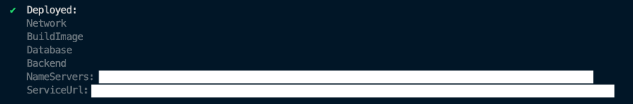

JP | [EN](README.md)

# REDCap deployment on AWS with serverless services

> すでにプロジェクトをデプロイ済みの場合は、アップグレード手順を確認してください。
>
> - **v1.0.0 から v1.0.1** (Mar 2024 release)　へのアップグレード手順は [CHANGELOG](./CHANGELOG.ja) を確認してください。
> - **v0.9.0 から v1.0.0** (Feb 2024 release)　へのアップグレード手順は [CHANGELOG](./CHANGELOG.ja) を確認してください。

[REDCap](https://projectredcap.org/) は、オンラインアンケートやデータベースを構築および管理するための安全なウェブアプリケーションです。特に、調査研究や業務におけるオンラインおよびオフラインのデータキャプチャをサポートすることを目的としています。

このプロジェクトは、AWS App Runner や Amazon Aurora Serverless などのオートスケーリング対応サービスを使用して、REDCap をデプロイおよび管理する方法を提供します。 このプロジェクトは[SST](https://sst.dev) を使用して構築されています。これは、すぐに使用できる多数のコンストラクタと、[IaC](https://docs.aws.amazon.com/whitepapers/latest/introduction-devops-aws/infrastructure-as-code.html) の開発をスピードアップできる多くの機能を備えた CDK ベースのフレームワークです。

> 以下のガイドはクイックスタートアップのガイドです。詳細なドキュメントについては [general documentation](./docs/ja/index.md) を参照してください。

## アーキテクチャ

以下は、オートスケーリングによる高可用性を実現するために設計されたサーバーレスアーキテクチャです。 アプリケーションの実行に必要な AWS リソースの分のみを支払う従量課金制モデルで利用でき、AWS Well-Architected Framework (<https://docs.aws.amazon.com/wellarchitected/latest/framework/welcome.html>) に準拠しています。


## 特徴

### 1. セキュリティ

1. **AWS WAF**: アプリケーションへのアクセスを制御するファイアウォール。REDCapにアクセスできるIP範囲を設定し、特定のエンドポイントへの不正アクセスをブロックできます。
2. **AWS Secrets Manager**: データベースや postfix 用の Amazon SES 認証情報などのサービスのシークレットを自動的に作成してローテーションします。
3. **Amazon VPC**: アプリケーションサーバーとデータベースはプライベートサブネットにデプロイされます。
4. **Amazon GuardDuty**: (Optional) AWS アカウント用のモニタリングおよび検出サービス。
5. **Amazon CloudWatch**: インフラストラクチャと REDCap の Apache アクセスログを監視します。
6. **AWS KMS**: ファイルストレージ、ログ、データベースなど、データは常に暗号化されて保存されます。

### 2. サーバーレス

1. **AWS App Runner**: ロードバランサー、自動スケーリング、自動コンテナデプロイ機能を備えているため、REDCap をいつでも利用できる状態にします。
2. **Amazon Aurora Serverless**: MySQL との互換性を持ちながら、Aurora Serverlessは必要に応じてデータベースを自動スケーリングできます。 REDCap の MySQL リードレプリカの設定はデフォルトで有効になっています。
3. **Amazon S3**: ファイルストレージでは、REDCap と Amazon S3 の統合が推奨設定されており、デフォルトで有効になっています。
4. **Amazon ECS on AWS Fargate**: 長いHTTPリクエストを処理することができる App Runner の代替となるコンピュート基盤

### 3. AWS CDK を用いた IaC

[AWS CDK](https://aws.amazon.com/cdk/) を使用して、アーキテクチャのデプロイや更新と REDCap のソフトウェアアップデートをローカルマシンから行えます。

### 4. 障害からの復旧

1. 特定の時点に「巻き戻す」ことでデータベースをバックトラックします。 デフォルト設定は 24 時間です。
2. 日次データベーススナップショット (バックアップ)
3. 障害または設定ミスした際のアプリケーションサーバーの自動ロールバック (blue-green deployment)
4. (Optional) Amazon S3 によるバージョン管理されたファイルストレージ

---

## REDCapアプリケーションのデプロイ

### 1. 前提条件

デプロイ実行するローカルマシンに Node.jsバージョン、v18.16.1以上のインストールが必要です。[こちら](https://nodejs.org/en/download/package-manager)のパッケージマネージャーを利用してインストール可能です。

[yarn](https://yarnpkg.com/)の利用を推奨します。Node.jsをインストール後、以下のコマンドでインストール可能です。

```sh
npm -g install yarn
```

### 2. 依存関係のインストール

```sh
yarn install
```

### 3. stages.ts ファイルによるStage設定

提供しているサンプルファイルを以下のコマンドでコピーし、必要に応じて値を変更してください。

```sh
cp stages.sample.ts stages.ts
```

各プロパティは以下の通りで、デプロイの設定が可能です。

| プロパティ名         | 説明                                                                                                                                                                                                                                                             | Type    | Default                                               |
| -------------------- | ---------------------------------------------------------------------------------------------------------------------------------------------------------------------------------------------------------------------------------------------------------------- | ------- | ----------------------------------------------------- |
| name                 | デプロイする環境ごとに付与する名前です。                                                                                                                                                                                                                         | String  | \* ユーザー定義                                       |
| profile              | AWS アカウントのプロファイルです。`~/.aws/config`に記載されているものを指定します。                                                                                                                                                                              | String  | \* ユーザー定義                                       |
| region               | Stack をデプロイする際に用いる AWS リージョンを指定します。                                                                                                                                                                                                      | String  | AWS config setting                                    |
| allowedIps           | REDCap アプリケーションに対して、アクセス元の IP を制限する場合、ここで許可する IP アドレスのリストを設定します。                                                                                                                                                | Array   | `['']`                                                |
| redCapLocalVersion   | デプロイする REDCap のバージョンを指定します。`packages/REDCap`ディレクトリに、`redcap${redCapLocalVersion}.zip`の形でファイルを配置する必要があります。下記の`redCapS3Path`プロパティを設定している場合、設定できません。                                       | String  | `undefined`(`redCapS3Path`が設定されている場合)       |
| redCapS3Path         | デプロイする REDCap のバージョンを指定します。あらかじめ、S3 上に zip 形式で REDCap アプリケーションをアップロードし、`${S3BucketName}/${S3ObjectKey}`の形でファイルの位置を指定します。上記の`redCapLocalVersion`プロパティを設定している場合、設定できません。 | String  | `undefined`(`redCapLocalVersion`が設定されている場合) |
| domain               | REDCap アプリケーションをホストする際に用いるドメイン名を指定します。                                                                                                                                                                                            | String  | `undefined`                                           |
| subdomain            | REDCap アプリケーションをホストする際に用いるサブドメインを指定します。                                                                                                                                                                                          | String  | `undefined`                                           |
| hostInRoute53 [1]        | ドメイン/サブドメインを Route53 に登録し、簡単に App Runner と SES のドメイン検証を行えるようにします。                                                                                                                                                          | Boolean or String | `true`                                                |
| email [2]                | App Runner サービスステータスに関するメール通知を受け取るメールアドレスを指定します。また、ドメインが指定されていない場合、このメールアドレスを使って認証を行います。                                                                                            | String  | `undefined`                                           |
| appRunnerConcurrency [3] | REDCap アプリケーションを動かす App Runner について、1 つのインスタンスが処理するリクエスト数の閾値を設定します。この値を超えると、インスタンスは自動で水平スケールします。                                                                                      | Number  | 10 (\*\*)                                             |
| appRunnerMaxSize     | REDCap アプリケーションを動かす App Runner について、インスタンススケール数の上限を設定します。                                                                                                                                                                  | Number  | 2                                                     |
| appRunnerMinSize     | REDCap アプリケーションを動かす App Runner について、インスタンススケール数の下限を設定します。                                                                                                                                                                  | Number  | 1                                                     |
| cronSecret           | `https:<your_domain>/cron.php`にアクセスするためのシークレットを作成するための元になる文字列を指定します。                                                                                                                                                       | String  | 'mysecret'                                            |
| cpu                  | インスタンスあたりの vCPU 数を指定します。                                                                                                                                                                                                                       | Cpu     | `Cpu.TWO_VCPU`                                        |
| memory               | インスタンスあたりのメモリ容量を指定します。                                                                                                                                                                                                                     | Memory  | `Memory.FOUR_GB`                                      |
| phpTimezone          | 例: 'Asia/Tokyo', <https://www.php.net/manual/en/timezones.php>                                                                                                                                                                                                  | String  | `UTC`                                                 |
| port                 | App Runnerで使用されるポート番号です。                                                                                                                                                                                                                           | String  | `UTC`                                                 |
| rebuildImage [4]         | デプロイを実行するたびにコンテナイメージのビルドを行うかどうか設定します。(\*\*\*)                                                                                                                                                                               | Boolean | `false`                                               |
| ec2ServerStack [5]       | 長時間実行リクエスト用の一時的な EC2 インスタンスの構成                                                                                                                                                                                                          | Object  | `undefined`                                           |
| ecs [6] | Amazon ECS on AWS FargateをAWS App Runnerの代わりに使用するための設定 | Object | `undefined` |

[1] `hostInRoute53` は必須の値です。既存のAmazon Route 53でホストされているゾーンを使用するには、ここにドメイン名を指定してください。 `domain` の設定値を使用して新しいホストゾーンを作成するには `true` を指定してください。Amazon Route 53を全く使用しない場合は `false` を指定してください。`hostInRoute53` を使用すると、このプロジェクトがドメインでAmazon SESを自動的に設定し、SSL接続用の証明書も作成できます。それ以外の場合は、SES、App Runner、証明書が必要なその他の接続を独自のDNSプロバイダーで手動で検証する必要があります。

[2] email を指定すると、AWS App Runnerのサービス配信や変更に関する通知を受け取るための登録メールが送信されます。このメールはAWS SESのIDとしても登録されます。

[3] デフォルトの並列処理数は10です。これは2vCPUと4GBの1インスタンスで最小限の負荷テストを行った結果に基づいています。負荷に応じてこの値を調整することをお勧めします。

[4] プロジェクトが初めてデプロイされると、自動ビルドがトリガーされます。変更が検出されなければ、デプロイごとに新しいイメージはビルドされません。これをtrueに設定すると、タイムスタンプを使用してデプロイごとにイメージの強制ビルドが行われます。falseに戻すと、このタイムスタンプを削除するために1回デプロイする必要があります。

[5] [EC2 Server Stack](#1-ec2-server-stack)

[6] [AWS App Runnerの代わりにAmazon ECS on AWS Fargateを使用する](#2-aws-app-runnerの代わりにamazon-ecs-on-aws-fargateを使用する)

### 4. REDCap の基本的設定

デプロイを行う前に、REDCap に関する基本的な設定を行います。

```sh
yarn gen redcap config
```

上記のコマンドを入力すると、対話式で設定を行うことができます。


この設定は、データベースの`redcap_config`テーブルに保存され、App Runnerインスタンスをアップデートするごとにアップデートできます。

デプロイが完了すると、次のような表示になります。



### 5. ドメインの設定

stages.tsファイルでhostInRoute53および/またはdomainのオプションを有効にした場合、独自のドメイン名をREDCapデプロイメントに接続できます。このドメインは以下のいずれかの方法で取得できます。

1. 同一AWSアカウントでAmazon Route 53に登録されたドメイン
2. 外部のAWSアカウントでAmazon Route 53に登録されたドメイン
3. 外部のDNSプロバイダに登録されたドメイン

例として、`acme.com`ドメインを所有していて、`redcap.acme.com`でREDCapをデプロイする場合を考えます。

#### 5.1 AWSアカウントでAmazon Route 53に登録されたドメインを使用する

##### 5.1.1 redcapをサブドメインとして使用する

このケースでは、ターゲットは`redcap.acme.com`にデプロイすることです。([ドメインの登録](https://docs.aws.amazon.com/Route53/latest/DeveloperGuide/registrar.html))とHosted Zoneの作成がすでに完了していることを前提としています。

このオプションでは、ステージ設定は次のようになります:

```ts
const prod: RedCapConfig = {
  ...baseOptions,
  hostInRoute53: 'acme.com',
  domain: 'acme.com',
  subdomain: 'redcap', // <-- 新しいHosted Zoneの作成 redcap.acme.com
  ...
```

これにより、`redcap.acme.com`の新しいHosted Zoneが作成され、既存のゾーンに委任されます。

##### 5.1.2 サブドメインを使用しない場合

このケースでは、`acme.com`にデプロイすることがゴールとなります。([ドメインの登録](https://docs.aws.amazon.com/Route53/latest/DeveloperGuide/registrar.html))とHosted Zoneの作成がすでに完了していることを前提としています。

このオプションでは、ステージ設定は次のようになります:

```ts
const prod: RedCapConfig = {
  ...baseOptions,
  hostInRoute53: 'acme.com', // <-- 既存のHosted Zoneを利用
  domain: 'acme.com',
  subdomain: undefined, // またはコメントアウト
  ...
```

これにより、既存のゾーンがSESの設定と証明書の作成に使用されます。このオプションを使用する際は注意が必要です。アプリや追加レコードがない新しいゾーンでのみこのオプションを使用することをおすすめします。

#### 5.2 別のAWSアカウントで登録されたドメインを使用する

##### 5.2.1 redcapをサブドメインとして使用

外部のAWSアカウントで登録されているドメイン名をお持ちの場合、このプロジェクトを使用して簡単にNSレコードを追加できます。このためには、外部アカウントのAWS認証情報プロファイルを指定する`route53NS`ステージをデプロイする必要があります。

外部AWSアカウントに`acme.com`のドメインが登録されているHosted Zoneがあるとします。

1. stage.tsを次のように設定します:

   ```ts
   const prod: RedCapConfig = {
   ...baseOptions,
   hostInRoute53: true,
   domain: 'acme.com',
   subdomain: 'redcap', // <-- 新しいHosted Zoneの作成 redcap.acme.com
   ...
   ```

2. [プロジェクトをデプロイします](#6-デプロイの実行)

3. デプロイ後のコンソール出力から`NameServersのリストを確認してください。これは外部アカウントにデプロイするNSレコードのリストです。

4. `stages.ts`の`route53NS`ステージを次のように設定します:

   ```ts
   const route53NS: DomainAppsConfig = {
     ...baseOptions,
     profile: 'your_external_aws_profile', // <-- ドメインを保有するアカウントのプロファイル
     region: 'ap-northeast-1', // <-- リージョンを更新
     apps: [
       {
         name: 'redcap', // <-- NSエントリのレコード名はredcap.redemo.site
         nsRecords: [
           // <-- デプロイ出力からのNSレコードリスト
           'ns-11111.awsdns-11.org',
           'ns-22.awsdns-22.com',
           'ns-33.awsdns-33.net',
           'ns-4444.awsdns-44.co.uk',
         ],
       },
     ],
     domain: 'acme.com', // <-- ターゲットとなる外部ドメイン
   };
   ```

5. `yarn deploy --stage route53NS`コマンドでドメインを保有するアカウントにデプロイします。

しばらくすると、AWS App Runnerを使用している場合、ドメインの証明書の検証が完了します。これには24-48時間かかることがありますが、ほとんどの場合はそれより早く完了します。

##### 5.2.2 サブドメインを使用しない場合

このオプションはまだ完全にサポートされていません。現時点では手動の介入が必要です。

1. Configure your `stage.ts`, it should look like this:

   ```ts
   const prod: RedCapConfig = {
   ...baseOptions,
   hostInRoute53: false, // <-- 新しいHosted Zoneは作成しない
   domain: 'acme.com',
   subdomain: undefined,
   ...
   ```

2. [プロジェクトをデプロイします](#6-デプロイの実行)

3. App Runnerドメインのリンク、SESドメインIDの設定、必要に応じてECS ALBのAレコードの作成をドメインのAWSアカウントで行ってください。

    - [Amazon SES creating identities](https://docs.aws.amazon.com/ses/latest/dg/creating-identities.html)
    - [App Runner custom domains](https://docs.aws.amazon.com/apprunner/latest/dg/manage-custom-domains.html)
    - [Routing traffic to an ELB load balancer](https://docs.aws.amazon.com/Route53/latest/DeveloperGuide/routing-to-elb-load-balancer.html)

#### 5.3 外部DNSプロバイダーを使用する

このシナリオでは、例としてacme.comを外部のDNSプロバイダーに登録したとします。

##### 5.3.1 redcapをサブドメインとして使用

1. stage.tsを次のように設定します(ecsプロパティは使用しないでください)

   ```ts
   const prod: RedCapConfig = {
   ...baseOptions,
   hostInRoute53: true, // <-- Create a new Hosted Zone.
   domain: 'acme.site',
   subdomain: 'redcap',
   ...
   ```

2. [プロジェクトをデプロイします](#6-デプロイの実行)

3. ターミナルの出力から、新しいHosted Zoneの4つのネームサーバー(NS)をredcapという名前でDNSプロバイダーに追加してください。

   ```text
   Type  name     NS                     TTL
   NS    redcap   ns-1267.awsdns-30.org. 1 Hour
   ....
   ....
   ```

4. しばらくすると、AWSマネジメントコンソールのApp Runnerで、Custom domains が緑の`Active`になり、ドメインにHTTPSでアクセスできるようになります。

5. AWSマネジメントコンソールのAmazon SESで、Configuration/Identitiesを確認し、ドメインをクリックしてIdentityステータスが`Verified`になっていることも確認してください。

##### 5.3.2 サブドメインを使用しない場合

このオプションはまだ完全にサポートされていません。現時点では手動の介入が必要です。

1. Configure your `stage.ts`, it should look like this:

   ```ts
   const prod: RedCapConfig = {
   ...baseOptions,
   hostInRoute53: false, // <-- 新しいHosted Zoneは作成しない
   domain: 'acme.com',
   subdomain: undefined,
   ...
   ```

2. [プロジェクトをデプロイします](#6-デプロイの実行)

3. App Runnerドメインのリンク、SESドメインIDの設定、必要に応じてECS ALBのAレコードの作成をDNSプロバイダーで行ってください。

    - [Amazon SES creating identities](https://docs.aws.amazon.com/ses/latest/dg/creating-identities.html)
    - [App Runner custom domains](https://docs.aws.amazon.com/apprunner/latest/dg/manage-custom-domains.html)
    - [Routing traffic to an ELB load balancer](https://docs.aws.amazon.com/Route53/latest/DeveloperGuide/routing-to-elb-load-balancer.html)

#### 5.4 登録済みのドメインをお持ちでない場合

AWS App Runnerを用いてデフォルトでデプロイした場合、ドメイン名が払い出され、それをテスト用に利用することができます。[Amazon Route 53](https://docs.aws.amazon.com/Route53/latest/DeveloperGuide/domain-register.html)で新しいドメイン名を登録し、 [こちら](#51-awsアカウントでamazon-route-53に登録されたドメインを使用する)の手順に従ってデプロイを完了することをお勧めします。

参考:

- [Amazon SES creating identities](https://docs.aws.amazon.com/ses/latest/dg/creating-identities.html)
- [App Runner custom domains](https://docs.aws.amazon.com/apprunner/latest/dg/manage-custom-domains.html)

### 6. デプロイの実行

以下のコマンドでデプロイを実行します。

```sh
yarn deploy --stage <your_stage_name>
```

> 警告: 一度に複数のステージ/環境をデプロイしないでください。

### 7. Amazon Simple Email Service (SES) のproduction設定

デフォルトでは、Amazon SES は sandbox モードでデプロイされます。 REDCapの設定チェックでは、`<redcapemailtest@gmail.com>`にメールを送信しますが、これが原因で失敗します。AWS コンソールから production アクセスをリクエストできます。 詳細は [こちら](./docs/ja/ses.md)をご確認ください。

デフォルトでは、`MAIL FROM domain` が `mail.<your_domain.com>` の形式であることを前提としています。 そうでない場合は、[Backend.ts](./stacks/Backend.ts) の `mailFromDomain` を `SimpleEmailService` コンストラクタに渡し、独自の形式を指定できます。

---

## REDCap バージョンの更新

> **以下の操作は、本番環境で行う前に、必ず別の開発用環境を作成しテストを行なってください。 [開発環境のセットアップ](./docs/ja/devenv.md)**

### 1. stages.ts ファイルの更新

`stages.ts` ファイル内のアップデートしたい環境の `redCapLocalVersion`または `redCapS3Path` を新しいバージョンに変更します。`redCapLocalVersion` を使用し、ローカルにある REDCap をデプロイする場合は、 `packages/REDCap/releases` ディレクトリに、`redcap${redCapLocalVersion}.zip`の形でファイルを配置します。例えば、`packages/REDCap/releases/redcap13.7.2.zip` のようになります。

### 2. アップデート

初回のデプロイと同様に、以下のコマンドを実行します。

> **注意**
> REDCap内部のアップグレードメカニズムは使用しないでください。これは一つのコンテナをだけアップデートするのもので、AWS App Runner上で稼働している全てのコンテナをアップデートしません。

```sh
yarn deploy --stage <your_stage_name>
```

コマンドでデプロイを実行します。

### 3. コンテナのビルドとデプロイの実行

AWS CodeBuildにより新しいDockerイメージをビルドし、新しいイメージをAWS App Runnerにデプロイします。実行するには、2つのオプションがあります。

#### 3.1 AWS Management Console

1. AWS Management Console に移動します。
2. CodeBuild の画面に遷移し、 Build Projects を選択します。
3. プロジェクトを選択し、`Start Build`を押します。

#### 3.2 AWS CLI から AWS Lambdaを呼び出す

1. ターミナルの出力 `UpdateDeploymentCommand` を確認し、コマンドをコピーします
2. 貼り付けて実行し、AWS CLI を呼び出し、更新とデプロイを開始します。

ステータスをモニタリングするには、AWS CLI を使用するか、AWS Management Consoleにアクセスして AWS CodeBuildで確認し、後で AWS App Runner のブルーグリーンデプロイを確認します。

> この Lambda 関数の実行は、プロジェクトを初めてデプロイするときにのみ自動的に呼び出されることに注意してください。 それより後の実行はサービスの`アップデート`と見なされ、自動的には行われず段階的に行われるように設計されています。

### 4. REDCap のアップグレードを実行する

> このコマンドを実行する前に、データベースのスナップショットを作成するか、障害が発生した場合に備えて [Aurora バックトラックウィンドウ機能](https://docs.aws.amazon.com/AmazonRDS/latest/AuroraUserGuide/AuroraMySQL.Managing.Backtrack.html)に慣れておくことをお勧めします。

デプロイが完了したら、`https://<your_domain>/upgrade.php?auto=1`にアクセスすることで、データベースが更新/移行されます。

または、`https://<your_domain>/upgrade.php` にアクセスし、 `Option A` 、 `Upgrade` の順にクリックすることでもデータベースを更新できます。

---

## REDCap Control center を確認する

デプロイ後に表示される警告はほとんどありません。以下は表示されていても正常です。

1. 最新のREDCapバージョンをデプロイしていない場合、`Some non-versioned files are outdated -` と表示されます。
2. `MYSQL DATABASE CONFIGURATION-` に関して、REDCap が推奨する設定の一部は、メモリ不足エラーが発生する可能性があるため、注意して実行する必要があります。 ユースケースを確認してください。パラメータを変更する必要がある場合は、[database stack](./stacks/Database.ts) で実行できます。
3. `Internal Service Check: Checking communication with the REDCap survey end-point -` が表示されますが、これは、このテストは AWS WAF にブロックされる方法で実行されるためです。`https://your_domain/surveys/` には通常のブラウザからアクセスできるはずです。 このチェックは AWS WAF コンソールで `AWS#AWSManagedRulesCommonRuleSet#NoUserAgent_HEADER`によってブロックされていることを確認できます。
4. MyCap `NOT making API Call - CRITICAL -` のテストも `3.` と同様にAWS WAFによってブロックされています。

詳細に関しては[本番環境への移行](./docs/ja/ptp.md)も合わせて参照してください。

## REDCap での長いリクエストの処理

AWS AppRunner には 120 秒のリクエストタイムアウトがあります。これは、 REDCap のインポート/エクスポートなどの一部の操作に対しては十分でない場合があります。この制限を克服するために、一時的なEC2サーバーと、ALB + ECSの二つのデプロイオプションを用意しています。

| Use case / Deployment                     | EC2 Server                    | App Runner | ECS               |
| ----------------------------------------- | ----------------------------- | ---------- | ----------------- |
| 大規模データのインポート                | OK (AWSの認証情報が必要) | X          | OK (4000秒の制限) |
| 通常利用                               | X                             | OK         | OK                |
| 120秒以上のリクエストが発生する通常利用 | X                             | X          | OK (4000秒の制限) |

### 1. EC2 Server stack

これは、AWS App Runner用にビルドされたREDCap Docker Imageを実行するAmazon EC2インスタンスをデプロイする一時的なスタックです。AWSユーザーは、ローカルコンピューターからこのEC2 REDCapサーバーに接続することができます。こうすることで、PHP、Apacheの設定、インターネットの接続性以外の要因で接続が制限されることはありません。

ログインするには、AWSの認証情報が必要です。

1. コンピュータに Session Manager plugin がインストールされていることを確認してください。 <https://docs.aws.amazon.com/systems-manager/latest/userguide/session-manager-working-with-install-plugin.html>

2. この新しい EC2 インスタンスを含むスタックをデプロイするには、`stages.ts` ファイルに ec2ServerStack プロパティを含める必要があります。

   ```ts
   const dev: RedCapConfig = {
   ...
   ec2ServerStack: {
      ec2StackDuration: Duration.hours(3),
   },
   };
   ```

`ec2StackDuration` パラメータは、このスタックを実行する期間を定義します。この時間後に破棄されます。

3. ステージをデプロイして出力を待ちます。 `ssmPortForward` を開始する次のようなコマンドが表示されます。

   ```sh
      ssmPortForward: aws ssm start-session --target i-00000000000 --document-name AWS-StartPortForwardingSession --parameters '{"portNumber":["8081"],"localPortNumber":["8081"]}' --region ap-northeast-1 --profile redcap
   ```

   手元のコンピューターで、ターミナルを開き、このコマンドを実行します。ブラウザを開き、 <https://localhost:8081>にアクセスします。自己署名証明書に関する警告が表示されますが、承諾してREDCapにアクセスします。このキーと証明書は、必要に応じて独自のものを利用できます。 変更したい場合は [cert フォルダ](./containers/redcap-docker-apache/apache2/cert/) に配置します。

### EC2 Server stack の考慮事項

CORS: REDCapのどの機能を使用するかによって、一部のモジュールでCORSの問題が発生する可能性があります。 この場合、コントロールセンターの `REDCap base URL` をプロキシを指すように設定する必要があります。(例: `https://localhost:8081`)。 これにより、構成されたドメインで実行している現在のユーザーに問題が発生しますので、作業が完了した後は変更を元に戻すようにしてください。

StateMachine: まだ期間内にあるec2ServerStackを削除する場合は、CloudFormationがリソースを削除できるように、あらかじめステートマシンを停止する必要があります。

### 2. AWS App Runnerの代わりにAmazon ECS on AWS Fargateを使用する

REDCapをAmazon ECSで使用するには、ECS ALBの証明書を作成するためにドメイン名が必要です。([詳細](https://docs.aws.amazon.com/ja_jp/elasticloadbalancing/latest/application/create-https-listener.html))この証明書がないと、REDCapは正しく動作しません。

[5. ドメイン設定](#5-ドメインの設定)の手順に従うか、Amazon Route 53でドメインが有効になっていることを確認した後、プロジェクトは証明書の作成を試みます。独自の証明書を提供したい場合は、[RedcapService.ts](./stacks/Backend/RedCapService.ts) を変更して証明書のARNを指定できます。

```ts
  this.ecsService = new EcsFargate(this.stack, `${this.app.stage}-${this.app.name}-ecs-service`, {
      app: this.app,
      ...
      certificate: {
        fromArn: 'your_certificate_arn' // <-- 更新
      },
  });

```

`state.ts`の変数`hostInRoute53: true`,と`domain: '<you_redcap_domain>'`も設定する必要があります。

例として、このステージでECSデプロイが有効になっています:

```ts
const stag: RedCapConfig = {
  ...baseOptions,
  hostInRoute53: true,
  phpTimezone: 'Asia/Tokyo',
  domain: 'redcap.mydomain.dev',
  redCapS3Path: 'redcap-bucket/redcap13.7.21.zip',
  cronSecret: 'asecret',
  email: 'myemail@mydomain.dev',
  ecs: { // <-- ecs設定.
    memory: '4 GB',
    cpu: '2 vCPU',
    scaling: {
      maxContainers: 3,
      minContainers: 1,
      requestsPerContainer: 100,
      cpuUtilization: 90,
    },
  },
```

重要: まず開発環境で変更をテストしてください。AWS App Runnerを使用してこのプロジェクトを以前にデプロイした場合、AWS App Runnerのリソースのみが破棄されます。これにはデータストレージのAmazon S3バケットやデータベースは含まれません。この変更には最大20分かかる場合があります。

---

## 環境の削除

環境を削除するには、以下のコマンドを実行します。

```sh
yarn destroy --stage <your_stage_name>
```

デフォルトでは、このコマンド実行時にデータベースのスナップショットが作成されます。

---

## License

This software is licensed under the [MIT-0 license](LICENSE)
