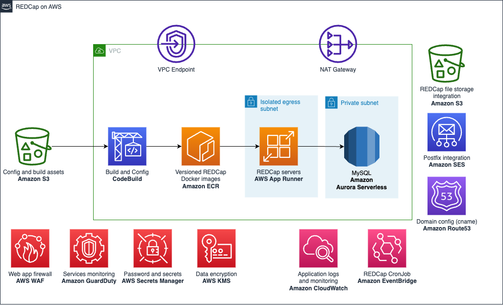
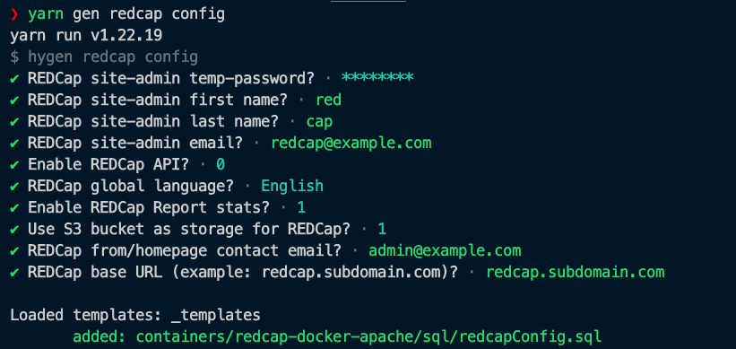
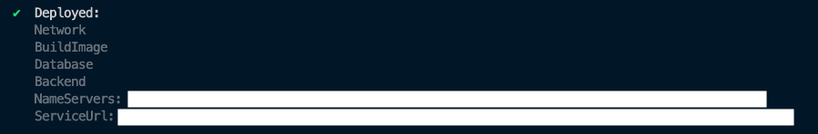

[JP](README.ja.md) | EN

# REDCap deployment on AWS with serverless services

> If you have deployed this project before, please check these upgrade procedures. Otherwise, you can ignore this.
>
> - **UPDATE procedures from v1.0.0 to v1.0.1** (Mar 2024 release) check [CHANGELOG](./CHANGELOG) for instructions.
> - **UPDATE procedures from v0.9.0 to v1.0.0** (Feb 2024 release) check [CHANGELOG](./CHANGELOG) for instructions.

[REDCap](https://projectredcap.org/) is a secure web application for building and managing online surveys and databases. It's specifically geared to support online and offline data capture for research studies and operations.

This project provides an automated way to deploy and manage a REDCap installation with autoscaling enabled services like AWS App Runner and Amazon Aurora Serverless. It's constructed using [SST](https://sst.dev), an AWS CDK based framework with many out of the box constructors and many other features that can speed up the development of [IaC](https://docs.aws.amazon.com/whitepapers/latest/introduction-devops-aws/infrastructure-as-code.html).

> The following guide is a quick startup, for more detailed documentation go to the [general documentation](./docs/en/index.md).

## Architecture

The following, is a serverless architecture designed for high availability with autoscaling. It allows a pay-as-you-go model, paying only for the AWS resources needed to run your application and it follows the [AWS Well-Architected Framework](https://docs.aws.amazon.com/wellarchitected/latest/framework/welcome.html)



## Main features

### 1. Security

1. **AWS WAF**: Firewall that controls the access to the application, you can configure what IP ranges are able to access REDCap and blocks un-authorized access to specific endpoints.
2. **AWS Secrets Manager**: Automatically create and rotate secrets for services like the database and SES credentials for postfix.
3. **Amazon VPC**: Application servers and database are deployed in private subnets.
4. **Amazon GuardDuty**: (Optional) Monitoring and detection service for you AWS account.
5. **Amazon CloudWatch**: Monitor your infrastructure and REDCap's Apache access logs.
6. **AWS KMS**: Your data is always stored encrypted, including file storage, logs and database

### 2. Serverless

1. **AWS App Runner**: Provides load balancer, autoscaling and automatic container deployments to ensure your REDCap setup is always available.
2. **Amazon Aurora Serverless**: With MySQL compatibility, Aurora serverless can auto scale your database as needed. MySQL Reader and writer configuration for REDCap is enabled by default.
3. **Amazon S3**: For file storage, REDCap integration with Amazon S3 is the recommended setting and enabled by default.
4. **Amazon ECS on AWS Fargate**: An alternative to AWS App Runner to run long user requests.

### 3. IaC using AWS CDK

Deploy and update your architecture and REDCap's software updates from your local machine using [AWS CDK](https://aws.amazon.com/cdk/).

### 4. Disaster recovery

1. Backtrack your database by "rewinding" to a specific point-in-time. Default setting 24 hours.
2. Daily Database snapshots (Backup).
3. Automatic rollback of application servers in case of failure or misconfiguration (blue-green deployment)
4. (Optional) Versioned file storage with Amazon S3

---

## How to deploy

A registered domain name is highly recommended for this deployment. To see what alternatives you have please have a look at [domain configuration](#5-domain-configuration) section.

### 1. Prerequisites

You need to install in your machine Node.js version >= v18.16.1. You can install it via package manager <https://nodejs.org/en/download/package-manager>.

It is recommended to use [yarn](https://yarnpkg.com/) >= 4.0.2, so after installing node, install it by

```sh
npm -g install yarn
```

### 2. Install Node.js dependencies

```sh
yarn install
```

### 3. Configure your stage in stages.ts file

Make a copy of the provided sample and edit it to your needs:

```sh
cp stages.sample.ts stages.ts
```

Each property described below allows you to configure your deployment.

| Property                 | Description                                                                                                                                                                                                                                           | Type              | Default                                   |
| ------------------------ | ----------------------------------------------------------------------------------------------------------------------------------------------------------------------------------------------------------------------------------------------------- | ----------------- | ----------------------------------------- |
| name                     | Name given to each environment to be deployed.                                                                                                                                                                                                        | String            | \* User defined                           |
| profile                  | AWS account profile. You need to specify what is set in `~/.aws/config`                                                                                                                                                                               | String            | \* User defined                           |
| region                   | Specify the AWS region to be used when deploying the stack.                                                                                                                                                                                           | String            | From AWS config                           |
| allowedIps               | If you want to restrict the IPs from which you can access the REDCap application, set a list of allowed IP addresses.                                                                                                                                 | Array             | `['']`                                    |
| redCapLocalVersion       | Specify the version of REDCap you want to deploy. You need to place files named as `redcap${redCapLocalVersion}.zip` in `packages/REDCap`. If `redCapS3Path` below is set, it cannot be set.                                                          | String            | `undefined`, if redCapS3Path is set       |
| redCapS3Path             | Specify the version of REDCap you want to deploy. First, upload the REDCap application in zip format to S3 and specify the location of the file in the form `${s3BucketName}/${s3ObjectKey}`. If `redCapLocalVersion` above is set, it cannot be set. | String            | `undefined`, if redCapLocalVersion is set |
| domain                   | Your DNS name to use in your REDCap installation.                                                                                                                                                                                                     | String            | `undefined`                               |
| subdomain                | Subdomain where your REDCap service is, e.g. redcap.mydomain.com                                                                                                                                                                                      | String            | `undefined`                               |
| hostInRoute53 [1]        | Enables the provided domain/subdomain to be registered in Route53 to allow easy enablement of SES and App Runner domain validations                                                                                                                   | Boolean or String | `true`                                    |
| email [2]                | Sets and enable email notification from App Runner service status and used to validate this email identity if a domain is not provided in the stage                                                                                                   | String            | `undefined`                               |
| appRunnerConcurrency [3] | The number of requests that a single REDCap instance can process. When the value is exceeded, it will trigger the auto-scaling.                                                                                                                       | Number            | 10                                        |
| appRunnerMaxSize         | Sets the upper limit on the number of instance App Runner can scale.                                                                                                                                                                                  | Number            | 2                                         |
| appRunnerMinSize         | Sets the minimum number of `warm` instances.                                                                                                                                                                                                          | Number            | 1                                         |
| cronSecret               | Base string to create a hashed secret to allow access to https:<your_domain>/cron.php                                                                                                                                                                 | String            | 'mysecret'                                |
| cpu                      | The number of vCpu assigned to each instance                                                                                                                                                                                                          | Cpu               | `Cpu.TWO_VCPU`                            |
| memory                   | The amount of memory assigned to each instance                                                                                                                                                                                                        | Memory            | `Memory.FOUR_GB`                          |
| phpTimezone              | Example: 'Asia/Tokyo', <https://www.php.net/manual/en/timezones.php>                                                                                                                                                                                  | String            | `UTC`                                     |
| port                     | Port number to be used in App Runner.                                                                                                                                                                                                                 | String            | `8080`                                    |
| rebuildImage [4]         | Whether to rebuild the REDCap Docker Image each time it is deployed                                                                                                                                                                                   | Boolean           | `false`                                   |
| ec2ServerStack [5]       | Configuration for a temporary EC2 instance for long running request                                                                                                                                                                                   | Object            | `undefined`                               |
| ecs [6]                  | Configuration to use Amazon ECS on AWS Fargate instead of AWS App Runner                                                                                                                                                                              | Object            | `undefined`                               |
| dbReaders                | Number of database read only instances                                                                                                                                                                                                                | Number            | `undefined`                               |
| dbSnapshotId             | Database snapshot to create a new database cluster                                                                                                                                                                                                    | String            | `undefined`                               |

- [1] `hostInRoute53`: is a required value. To use an existing Hosted Zone in Amazon Route 53, provide the domain name here. Use `true` to create a new Hosted Zone with the configured `domain` value. Use `false` to not use Amazon Route 53 at all. Using `hostInRoute53` allows this project to automatically configure Amazon SES with the domain and also create certificates for SSL connections. Otherwise, validate SES, App Runner, or any connection that requires a certificate manually with your own DNS provider.

- [2] If you specify an **email**, you will receive an email to subscribe to AWS App Runner service notifications, alerting you of services deployments and changes. This email will also be registered as an identity for AWS SES.

- [3] Concurrency default value is 10. It is calculated after a minimum load testing over one instance with 2vCPU and 4GB. We recommended you perform some load monitoring for tunning this value according to your load usage.

- [4] The first time the project is deployed, an automatic build is triggered. If no more changes are detected for the build, new images are not built for every deploy. Setting this to true will force a new image build for each deploy using a timestamp value. Reverting back to false, you'll need to deploy once to remove this timestamp.

- [5] [Ec2 server stack](#1-ec2-server-stack)

- [6] [Use Amazon ECS on AWS Fargate instead of AWS App Runner for REDCap instances](#2-use-amazon-ecs-on-aws-fargate-instead-of-aws-app-runner-for-redcap-instances)

### 4. Configure basic REDCap settings

Before deploying, configure basic settings related to REDCap.

```sh
yarn gen redcap config
```

You can configure each setting interactively:



The configuration is stored in the database table `redcap_config` and can be updated each time you update your App Runner instances.

### 5. Domain configuration

If you have enabled the options `hostInRoute53` and/or `domain` in your stages.ts file, you can connect a domain name that you own to your REDCap deployment. This domain can be from:

1. A domain registered in your account in Amazon Route 53
2. A domain registered in an external AWS account in Amazon Route 53
3. A domain registered in an external DNS provider.

For explanation purposes, we will assume we own the `acme.com` domain and our intention is to deploy REDCap at the `redcap.acme.com`.

#### 5.1 Use a registered domain in your AWS account in Amazon Route 53

##### 5.1.1 Use redcap as subdomain

For this case, our target is to deploy at `redcap.acme.com`. We assumed you have register a new domain, more info [here](https://docs.aws.amazon.com/Route53/latest/DeveloperGuide/registrar.html) and a Hosted zone already exists.

In this option, your stage config should look like this:

```ts
const prod: RedCapConfig = {
  ...baseOptions,
  hostInRoute53: 'acme.com',
  domain: 'acme.com',
  subdomain: 'redcap', // <-- Create a new Hosted Zone named redcap.acme.com
  ...
```

This will create a new Hosted Zone for `redcap.acme.com` and delegating to your exiting zone.

##### 5.1.2 Without a subdomain

For this case, our target is to deploy at `acme.com`. We assumed you have register a new domain, more info [here](https://docs.aws.amazon.com/Route53/latest/DeveloperGuide/registrar.html) and a Hosted zone already exists.

In this option, your stage config should look like this:

```ts
const prod: RedCapConfig = {
  ...baseOptions,
  hostInRoute53: 'acme.com', // <-- Use the existing zone
  domain: 'acme.com',
  subdomain: undefined, // or commented.
  ...
```

This will use your exising zone to configure SES and create certificates. Be careful using this option. We also recommend to use this in a newly created zone without any apps or additional records in it.

#### 5.2 Use a registered domain in an external AWS account

##### 5.2.1 Use redcap as subdomain

If you own a domain name that is registered in a separated AWS account, you can easily add NS records with this project by deploying a special `route53NS` stage. This stage requires you to provide the AWS credentials profile of the external account.

We assume the external AWS account has a Hosted Zone with the DNS registered like `acme.com`.

1. Configure your `stage.ts`, it should look like this:

   ```ts
   const prod: RedCapConfig = {
   ...baseOptions,
   hostInRoute53: true,
   domain: 'acme.com',
   subdomain: 'redcap', // <-- Create a new Hosted Zone named redcap.acme.com
   ...
   ```

2. [Deploy the project.](#6-deploy-the-project)

3. Look at the console output after deploying for the output of `NameServers`. This is a list of NS records we will be deploying for the external account.

4. In the `stages.ts`, find the `route53NS` stage and configure as following:

   ```ts
   const route53NS: DomainAppsConfig = {
     ...baseOptions,
     profile: 'your_external_aws_profile',
     region: 'ap-northeast-1', // <-- update to your region
     apps: [
       {
         name: 'redcap', // <-- Record name for the NS entry will be redcap.redemo.site.
         nsRecords: [
           // <-- List of NS records from deployment output
           'ns-11111.awsdns-11.org',
           'ns-22.awsdns-22.com',
           'ns-33.awsdns-33.net',
           'ns-4444.awsdns-44.co.uk',
         ],
       },
     ],
     domain: 'acme.com', // <-- Target external domain
   };
   ```

5. Deploy to the external account: `yarn deploy --stage route53NS`

After a while, and if you are using AWS App Runner, the certificate validation will be complete for your domain. This can take 24-48 hours, but most of the time it can be much less.

##### 5.2.2 Without a subdomain

This case is not yet fully supported. At the moment it can be achieved using manual intervention.

1. Configure your `stage.ts`, it should look like this:

   ```ts
   const prod: RedCapConfig = {
   ...baseOptions,
   hostInRoute53: false, // <-- Do not create new Hosted Zone.
   domain: 'acme.com',
   subdomain: undefined,
   ...
   ```

2. [Deploy the project.](#6-deploy-the-project)

3. Follow the steps to link a App Runner domain, configure SES domain identity and create an A record for your ECS ALB if required on your domain AWS account.

    - [Amazon SES creating identities](https://docs.aws.amazon.com/ses/latest/dg/creating-identities.html)
    - [App Runner custom domains](https://docs.aws.amazon.com/apprunner/latest/dg/manage-custom-domains.html)
    - [Routing traffic to an ELB load balancer](https://docs.aws.amazon.com/Route53/latest/DeveloperGuide/routing-to-elb-load-balancer.html)

#### 5.3 External DNS provider

For this scenario, we will assume that we have registered our example DNS name `acme.com` in a **external** DNS provider.

##### 5.3.1 Use redcap as subdomain

1. Configure your `stage.ts`, it should look like this (do not use the `ecs` property):

   ```ts
   const prod: RedCapConfig = {
   ...baseOptions,
   hostInRoute53: true, // <-- Create a new Hosted Zone.
   domain: 'acme.site',
   subdomain: 'redcap',
   ...
   ```

2. [Deploy the project.](#6-deploy-the-project)

3. From the terminal output, add the 4 Name Servers (NS) from your new Hosted Zone to your DNS provider with name `redcap`.

   ```text
   Type  name     NS                     TTL
   NS    redcap   ns-1267.awsdns-30.org. 1 Hour
   ....
   ....
   ```

4. After a while, in the AWS Console / App Runner / `Custom domains` it should become green `Active` and you can access your domain with HTTPS.

5. Also in the console, check the Amazon SES / Configuration / Identities, click your domain and check that the Identity status is `Verified`

##### 5.3.2 Without a subdomain

This case is not yet fully supported. At the moment it can be achieved using manual intervention.

1. Configure your `stage.ts`, it should look like this:

   ```ts
   const prod: RedCapConfig = {
   ...baseOptions,
   hostInRoute53: false, // <-- Do not create new Hosted Zone.
   domain: 'acme.com',
   subdomain: undefined,
   ...
   ```

2. [Deploy the project.](#6-deploy-the-project)

3. Follow the steps to link a App Runner domain, configure SES domain identity and create an A record for your ECS ALB if required on your DNS provider.

    - [Amazon SES creating identities](https://docs.aws.amazon.com/ses/latest/dg/creating-identities.html)
    - [App Runner custom domains](https://docs.aws.amazon.com/apprunner/latest/dg/manage-custom-domains.html)
    - [Routing traffic to an ELB load balancer](https://docs.aws.amazon.com/Route53/latest/DeveloperGuide/routing-to-elb-load-balancer.html)

#### 5.4 If you do not own a registered domain

The default deployment with AWS App Runner will provide you a HTTPS domain that you can use for testing your deployment. However, we do recommend you to manually register a new domain name in [Amazon Route 53](https://docs.aws.amazon.com/Route53/latest/DeveloperGuide/domain-register.html) and follow the instructions [here](#51-use-a-registered-domain-in-your-aws-account-in-amazon-route-53) to complete your installation.

More info:

- [Amazon SES creating identities](https://docs.aws.amazon.com/ses/latest/dg/creating-identities.html)
- [App Runner custom domains](https://docs.aws.amazon.com/apprunner/latest/dg/manage-custom-domains.html)

### 6. Deploy the project

Run deployment by entering the following command.

```sh
yarn deploy --stage <your_stage_name>
```

> Warning: Do not deploy more than one stage/environment at a time.

Once the deployment is complete, you'll see output like this:



### 7. Amazon Simple Email Service (SES) - production mode

By default, SES is deployed in sandbox mode, meaning that any email you send that is not a valid identity will fail. REDCap's configuration check, that sends an email to `<redcapemailtest@gmail.com>`, will fail due this. You can request production access from the AWS console. More info [here](./docs/en/ses.md)

The installation by default assumes your `MAIL FROM domain` to be in the form of `mail.<your_domain.com>`. If this is not the case, you can modify the [Backend.ts](./stacks/Backend.ts) file and the property `mailFromDomain` to the `SimpleEmailService` constructor to specify one.

---

## Updating REDCap versions

> **Before performing a version upgrade in a production environment, be sure to test your changes in another environment for testing. [Setup development environment](./docs/en/devenv.md)**

### 1. Update stages.ts file

Change the `redcapLocalVersion` or the `redCapS3Path` of the environment you want to update with the file location pointing to the new version. If you have a local copy of redcap, place it as `redcap<version>.zip` in the `packages/REDCap/releases` directory. Example: `packages/REDCap/releases/redcap13.7.2.zip`

### 2. Deploy updates

Same as the initial deployment, run the deployment with the command below.

> Warning: Do not use REDCap's internal upgrade mechanism. This only updates a single container and not your entire fleet on AWS App Runner.

```sh
yarn deploy --stage <your_stage_name>
```

### 3. Call the container build and deploy function

This is an AWS Codebuild process that will build the new docker image and trigger a new App Runner deployment. To do this, you have two options:

#### 3.1 AWS Management Console

1. Go to your AWS Management Console.
2. Codebuild and Build Projects.
3. Click on the selected environment and press `Start Build`.

#### 3.2 Call AWS lambda via terminal CLI

1. Check for the terminal output `UpdateDeploymentCommand` and copy the command
2. Paste and execute to call the AWS cli and start the update and deployment process.

To monitor the status, you can use the AWS CLI or access the AWS Console to check AWS CodeBuild and later the Blue-Green deployment of AWS App Runner.

> It's important to mention that this lambda execution is automatically called only for the first time you deploy your architecture. Future executions are considered `updates` to the service and are designed to be in a step-by-step manner.

### 4. Run REDCap upgrade function

> Before executing this command, it is recommended to do a database snapshot or get familiar with [Aurora backtrack window feature](https://docs.aws.amazon.com/AmazonRDS/latest/AuroraUserGuide/AuroraMySQL.Managing.Backtrack.html) in case of failure.

Once deployment is complete, REDCap's database is updated/migrated by accessing `https://<your_domain>/upgrade.php?auto=1`.

Alternatively, you can access in your browser to `https://<your_domain>/upgrade.php` and click on `Option A` --> `Upgrade` to upgrade the database tables.

---

## REDCap's Control center checks

There are few warnings that you might see after deployment. The expected ones are:

1. `Some non-versioned files are outdated -`, if you are not deploying the latest REDCap version
2. `MYSQL DATABASE CONFIGURATION -`, some of the recommended settings by REDCap should be executed with care, as they can lead to out of memory errors. Please check you use case, and if you need to change parameters, you can do it in the [database stack](./stacks/Database.ts)
3. `Internal Service Check: Checking communication with the REDCap survey end-point -`, this test is executed in a way that AWS WAF is blocking it, but the endpoint https://your_domain/surveys/ should be accessible from a normal browser. You can check this blocked by `AWS#AWSManagedRulesCommonRuleSet#NoUserAgent_HEADER` in the AWS WAF console.
4. MyCap `NOT making API Call - CRITICAL -`, this test is also blocked by AWS WAF as previous number (3).

For more detail, please refer [Path to production](./docs/en/ptp.md).

---

## Long running request to REDCap servers

AWS App Runner has a request timeout of 120 seconds. This might not enough for all REDCap's operations like importing/exporting project data. To overcome this limitation, we offer two additional deploying alternatives with Amazon EC2 Server and Amazon ECS on Fargate.

This table can help you decide when to use the options:

| Use case / Deployment                     | EC2 Server                    | App Runner | ECS               |
| ----------------------------------------- | ----------------------------- | ---------- | ----------------- |
| Import big REDCap projects                | OK (Requires AWS credentials) | X          | OK (max 4000 sec) |
| Regular use                               | X                             | OK         | OK                |
| Regular use with request over 120 seconds | X                             | X          | OK (max 4000 sec) |

### 1. EC2 Server stack

It is a temporary stack that deploys an Amazon EC2 instance running the same REDCap docker image build for AWS App Runner. AWS users can then tunnel to this EC2 REDCap server from a local computer. This way, your request are limited only by your PHP, Apache configurations and Internet connectivity.

You will require AWS credentials to login.

1. Make sure you have installed in your computer the Session Manager plugin <https://docs.aws.amazon.com/systems-manager/latest/userguide/session-manager-working-with-install-plugin.html>.

2. To deploy this new stack with the EC2 instance, you have to configure your stage file with the `ec2ServerStack` property:

   ```ts
   const dev: RedCapConfig = {
   ...
   ec2ServerStack: {
      ec2StackDuration: Duration.hours(3),
   },
   };
   ```

   The `ec2StackDuration` parameter defines how long this instance should run, after this time it will be destroyed.

3. Deploy your stage and wait for the output. It will show the command to start the tunnel `ssmPortForward`. It looks similar to this:

   ```sh
      ssmPortForward: aws ssm start-session --target i-00000000000 --document-name AWS-StartPortForwardingSession --parameters '{"portNumber":["8081"],"localPortNumber":["8081"]}' --region ap-northeast-1 --profile redcap
   ```

   In your computer, open a terminal run this command. Open a browser and visit <https://localhost:8081>. You will need to accept the warning about the self-signed certificate to access REDCap. This key and certificate can be updated to provide your own if you wish, the files are in the [certificates folder](./containers/redcap-docker-apache/apache2/cert/).

#### Considerations

- **CORS**: Depending on what REDCap feature you will use; you might encounter CORS issues for some modules. If this happens, you will need to configure the `REDCap base URL` in the Control Center to point your proxy e.g. `https://localhost:8081`, this will cause issues for your current users that are running under the configured domain, so please use it with caution and do not forget to revert the changes after you have finished your workload.

- **StateMachine**: If you wish to delete the `ec2ServerStack` that is still inside the time duration, you will need to stop the state machine first so CloudFormation can delete the resources.

### 2. Use Amazon ECS on AWS Fargate instead of AWS App Runner for REDCap instances

To use `REDCap with Amazon ECS`, you will need a domain name to create a certificate for the ECS ALB [more info](https://docs.aws.amazon.com/elasticloadbalancing/latest/application/create-https-listener.html). REDCap will **not** operate correctly without this certificate.

After following the steps in [5. Domain configuration](#5-domain-configuration) or having a domain activate in Amazon Route 53, the deployer will attempt to create the certificate. If you want to provide your own certificate, you can modify the [RedcapService.ts](./stacks/Backend/RedCapService.ts) to provide a certificate `ARN`.

```ts
  this.ecsService = new EcsFargate(this.stack, `${this.app.stage}-${this.app.name}-ecs-service`, {
      app: this.app,
      ...
      certificate: {
        fromArn: 'your_certificate_arn' // <-- update
      },
  });

```

You must also make sure you configure the `state.ts` variables for `hostInRoute53: true,` and `domain: '<you_redcap_domain>'`.

As an example, the ECS deployment is activate by this stage:

```ts
const stag: RedCapConfig = {
  ...baseOptions,
  hostInRoute53: true,
  phpTimezone: 'Asia/Tokyo',
  domain: 'redcap.mydomain.dev',
  redCapS3Path: 'redcap-bucket/redcap13.7.21.zip',
  cronSecret: 'asecret',
  email: 'myemail@mydomain.dev',
  ecs: { // <-- ecs config.
    memory: '4 GB',
    cpu: '2 vCPU',
    scaling: {
      maxContainers: 3,
      minContainers: 1,
      requestsPerContainer: 100,
      cpuUtilization: 90,
    },
  },
```

**Important:** Test you change in a development environment first. If you have previously deployed this project using AWS App Runner and choose to use Amazon ECS, only the AWS App Runner resources will be destroyed, this does not include Amazon S3 buckets for data storage or database. This only change can take up to 20 minutes to complete.

---

## Deploy or restore from a database snapshot

In your stages.ts add the parameter `dbSnapshotId` with the snapshot name as value and deploy.

```ts
const test: RedCapConfig = {
  ...baseOptions,
  // ...more options
  dbSnapshotId: 'redcap-dev', // Snapshot name.
};
```

This will create a new database cluster and delete the existing one.

---

## Delete an environment

To delete an environment and all its resources, run the following command:

```sh
yarn destroy --stage <your_stage_name>
```

By default, a database SNAPSHOT will be created while executing this command.

---

## License

This software is licensed under the [MIT-0 license](LICENSE)
