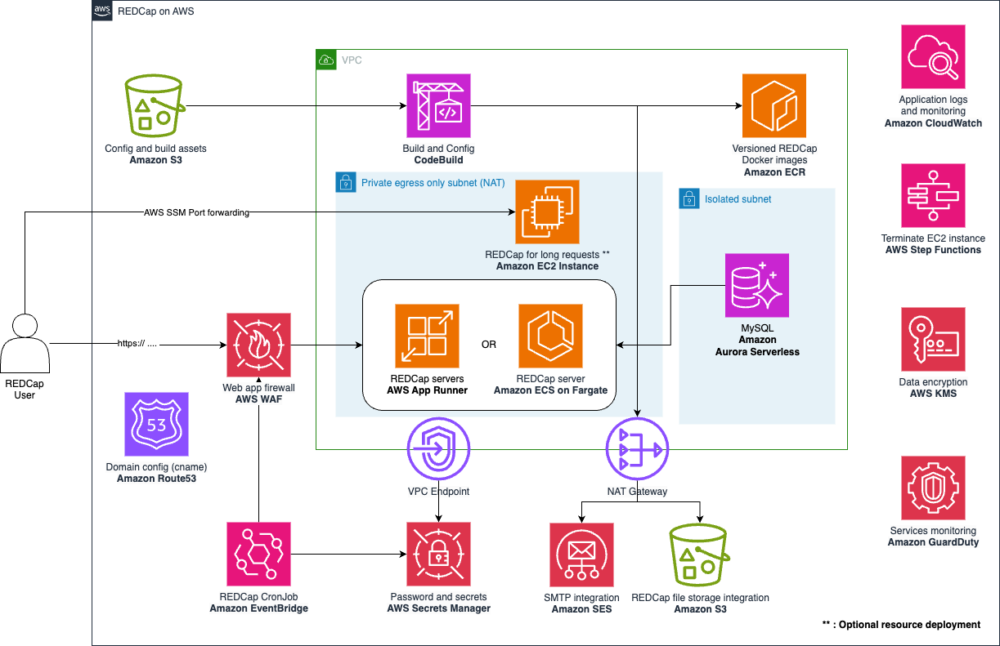

[JP](README.ja.md) | EN

# REDCap deployment on AWS with serverless services

[REDCap](https://projectredcap.org/) is a secure web application for building and managing online surveys and databases. It's specifically geared to support online and offline data capture for research studies and operations.

This project provides an automated way to deploy and manage a REDCap installation with autoscaling enabled services like AWS App Runner and Amazon Aurora Serverless. It's constructed using [SST](https://sst.dev), a AWS CDK based framework with many out of the box constructors and many other features that can speed up the development of [IaC](https://docs.aws.amazon.com/whitepapers/latest/introduction-devops-aws/infrastructure-as-code.html).

> The following guide is a quick startup, for more detailed documentation go to the [general documentation](./docs/en/index.md).

## Architecture

The following, is a serverless architecture designed for high availability with autoscaling. It allows a pay-as-you-go model, paying only for the AWS resources needed to run your application and it follows the [AWS Well-Architected Framework](https://docs.aws.amazon.com/wellarchitected/latest/framework/welcome.html)



The architecture in details is [here](docs/images/architecture-detail.png).

### Main features

#### 1. Security

1. **AWS WAF**: Firewall that controls the access to the application, you can configure what IP ranges are able to access REDCap and blocks un-authorized access to specific endpoints.
2. **AWS Secrets Manager**: Automatically create and rotate secrets for services like the database and SES credentials for postfix.
3. **Amazon VPC**: Application servers and database are deployed in private subnets.
4. **Amazon GuardDuty**: (Optional) Monitoring and detection service for you AWS account.
5. **Amazon CloudWatch**: Monitor your infrastructure and REDCap's Apache access logs.
6. **AWS KMS**: Your data is always stored encrypted, including file storage, logs and database

#### 2. Serverless

1. **AWS App Runner**: Provides load balancer, autoscaling and automatic container deployments to ensure your REDCap setup is always available.
2. **Amazon Aurora Serverless**: With MySQL compatibility, Aurora serverless can auto scale your database as needed. MySQL Reader and writer configuration for REDCap is enabled by default.
3. **Amazon S3**: For file storage, REDCap integration with Amazon S3 is the recommended setting and enabled by default.

#### 3. IaC using AWS CDK

Deploy and update your architecture and REDCap's software updates from your local machine using [AWS CDK](https://aws.amazon.com/cdk/).

#### 4. Disaster recovery

1. Backtrack your database by "rewinding" to a specific point-in-time. Default setting 24 hours.
2. Daily Database snapshots (Backup).
3. Automatic rollback of application servers in case of failure or misconfiguration (blue-green deployment)
4. (Optional) Versioned file storage with Amazon S3

## License

This software is licensed under the Amazon Software License [ASL](https://aws.amazon.com/asl/)

## How to deploy

### Prerequisites

You need to install in your machine Node.js version >= v18.16.1. You can install it via package manager <https://nodejs.org/en/download/package-manager>.

It is recommended to use [yarn](https://yarnpkg.com/), so after installing node, install it by

```sh
npm -g install yarn
```

### 1. Install Node.js dependencies

```sh
yarn install
```

### 2. Configure your stage in stages.ts file

Make a copy of the provided sample and edit it to your needs:

```sh
cp stages.sample.ts stages.ts
```

Each property described below allows you to configure your deployment.

| Property             | Description                                                                                                                                                                                                                                           | Type    | Default                                   |
| -------------------- | ----------------------------------------------------------------------------------------------------------------------------------------------------------------------------------------------------------------------------------------------------- | ------- | ----------------------------------------- |
| name                 | Name given to each environment to be deployed.                                                                                                                                                                                                        | String  | \* User defined                           |
| profile              | AWS account profile. You need to specify what is set in `~/.aws/config`                                                                                                                                                                               | String  | \* User defined                           |
| region               | Specify the AWS region to be used when deploying the stack.                                                                                                                                                                                           | String  | From AWS config                           |
| allowedIps           | If you want to restrict the IPs from which you can access the REDCap application, set a list of allowed IP addresses.                                                                                                                                 | Array   | `['']`                                    |
| redCapLocalVersion   | Specify the version of REDCap you want to deploy. You need to place files named as `redcap${redCapLocalVersion}.zip` in `packages/REDCap`. If `redCapS3Path` below is set, it cannot be set.                                                          | String  | `undefined`, if redCapS3Path is set       |
| redCapS3Path         | Specify the version of REDCap you want to deploy. First, upload the REDCap application in zip format to S3 and specify the location of the file in the form `${s3BucketName}/${s3ObjectKey}`. If `redCapLocalVersion` above is set, it cannot be set. | String  | `undefined`, if redCapLocalVersion is set |
| domain               | Your DNS name to use in your REDCap installation.                                                                                                                                                                                                     | String  | `undefined`                               |
| subDomain            | Subdomain where your REDCap service is, e.g redcap.mydomain.com                                                                                                                                                                                       | String  | `undefined`                               |
| hostInRoute53        | Enables the provided domain/subdomain to be registered in Route53 to allow easy enablement of SES and App Runner domain validations                                                                                                                   | Boolean | `true`                                    |
| email                | Sets and enable email notification from App Runner service status and used to validate this email identity if a domain is not provided in the stage                                                                                                   | String  | `undefined`                               |
| appRunnerConcurrency | The number of requests that a single REDCap instance can process. When the value is exceeded, it will trigger the auto-scaling.                                                                                                                       | Number  | 10 (\*\*)                                 |
| appRunnerMaxSize     | Sets the upper limit on the number of instance App Runner can scale.                                                                                                                                                                                  | Number  | 2                                         |
| appRunnerMinSize     | Sets the minimum number of `warm` instances.                                                                                                                                                                                                          | Number  | 1                                         |
| cronSecret           | Base string to create a hashed secret to allow access to https:<your_domain>/cron.php                                                                                                                                                                 | String  | 'mysecret'                                |
| cpu                  | The number of vCpu assigned to each instance                                                                                                                                                                                                          | Cpu     | `Cpu.TWO_VCPU`                            |
| memory               | The amount of memory assigned to each instance                                                                                                                                                                                                        | Memory  | `Memory.FOUR_GB`                          |
| phpTimezone          | Example: 'Asia/Tokyo', <https://www.php.net/manual/en/timezones.php>                                                                                                                                                                                  | String  | `UTC`                                     |
| port                 | Port number to be used in App Runner.                                                                                                                                                                                                                 | String  | `8080`                                    |

- Service Notifications: If you specify an **email**, you will receive an email to subscribe to AWS App Runner service notifications, alerting you of services deployments and changes.

- Enabling up `hostInRoute53` will create a Route53 DNS record where your SES identity and App Runner certificate validations are done. If you do not provide this, you need to validate SES and App Runner manually with your own DNS provider. More information about this is provided bellow.

- (\*) Required value

- (\*\*) Concurrency default value is 10 is calculated after a minimum load testing over one instance with 2vCPU and 4GB. It is recommended you perform some load monitoring for tunning this value according to your load usage.

### 3. Configure basic REDCap settings

Before deploying, configure basic settings related to REDCap.

```sh
yarn gen redcap config
```

You can configure each settings interactively:


The configuration is stored in the database table `redcap_config` and can be updated each time you update your App Runner instances.

### 4. Run the deployment

Run deployment by entering the following command.

```sh
yarn deploy --stage <your_stage_name>
```

> Warning: Do not deploy more than one stage/environment at a time.

Once the deployment is complete, you'll see output like this:


### 5. Domain configuration

If you have configured a `hostInRoute53` in your stages.ts file , you can link it with external domains that you own to your REDCap's deployment. Here are a few options:

1. If your DNS for REDCap is hosted in another DNS provider, go to your domain provider website and add a simple `NS` record with the name servers provided in the console output after deployment from step `4. Run deployment`.

   ```yml
   Example
   NameServers: ns-11111.awsdns-11.org,ns-22.awsdns-22.com,ns-333.awsdns-33.net,ns-4444.awsdns-44.co.uk
   ```

   The record name for this `NS` entry should be the same as your `domain` setting in `stages.ts` file. After a while, App Runner will validate a certificate for your domain. This can take 24-48 hours, but most of the time it can be much less.

2. If you don't own a domain, you have two choices:
   - First, you can use the provided App Runner default DNS.
   - Second, you can register a DNS in [Amazon Route 53](https://docs.aws.amazon.com/Route53/latest/DeveloperGuide/domain-register.html)

If you don't want to use Route53 and you want to link a domain you own, you must manually verify Amazon SES identity and AWS App Runner certificate with your external DNS provider. You can do this by following the AWS Console for each service. More info: [Amazon SES creating identities](https://docs.aws.amazon.com/ses/latest/dg/creating-identities.html) and [App Runner custom domains](https://docs.aws.amazon.com/apprunner/latest/dg/manage-custom-domains.html)

This projects allows you to add the NS records to Amazon Route53 in the same or external account.

1. Complete the first deploy and copy the list of NS records returned `NameServers`.
2. In the `stages.ts` file edit paste the NS records and configure your stack. For example:

   ```ts
   const route53NS: DomainAppsConfig = {
   ...baseOptions,
   profile: 'your_aws_profile',
   region: 'your_aws_region',
   apps: [
      {
         name: 'prod',
         nsRecords: [
         'ns-sample.co.uk',
         'ns-sample.net',
         'ns-sample.org',
         'ns-sample.com',
         ],
      },
      {
         name: 'stag'
         nsRecords: [...]
      }
   ],
   domain: 'mydomain.com',
   };
   ```

   > You can add more than one application (apps) for different environments that you have deployed.

3. Deploy the stack that creates the NS records by executing

   `yarn deploy --stage route53NS`

### 6. Amazon Simple Email Service (SES) - production mode

By default, SES is deployed in sandbox mode. You can request production access from the AWS console. More info [here](./docs/en/ses.md)

The installation by default assumes your `MAIL FROM domain` to be in the form of `mail.<your_domain.com>`. If this is not the case, you can modify the [Backend.ts](./stacks/Backend.ts) file and the property `mailFromDomain` to the `SimpleEmailService` constructor to specify one.

## Updating REDCap

> **Before performing a version upgrade in a production environment, be sure to test your changes in another environment for testing. [Setup development environment](./docs/en/devenv.md)**

### 1. Update stages.ts file

Change the `redcapLocalVersion` or the `redCapS3Path` of the environment you want to update with the file location pointing to the new version. If you have a local copy of redcap, place it as `redcap<version>.zip` in the `packages/REDCap/releases` directory. Example: `packages/REDCap/releases/redcap13.7.2.zip`

### 2. Deploy updates

Same as the initial deployment, run the deployment with the command below.

> Warning: Do not use REDCap's internal upgrade mechanism. This only updates a single container and not your entire fleet on AWS App Runner.

```sh
yarn deploy --stage <your_stage_name>
```

### 3. Call the container build and deploy function

This is an AWS Codebuild process that will build the new docker image and trigger a new App Runner deployment. To do this, you have two options:

#### 3.1 AWS Management Console

1. Go to your AWS Management Console.
2. Codebuild and Build Projects.
3. Click on the selected environment and press `Start Build`.

#### 3.2 Call AWS lambda via terminal CLI

1. Check for the terminal output `UpdateDeploymentCommand` and copy the command
2. Paste and execute to call the AWS cli and start the update and deployment process.

To monitor the status, you can use the AWS CLI or access the AWS Console to check AWS CodeBuild and later the Blue-Green deployment of AWS App Runner.

> It's important to mention that this lambda execution is automatically called only for the first time you deploy your architecture. Future executions are considered `updates` to the service and are designed to be in a step-by-step manner.

### 4. Run REDCap upgrade function

> Before executing this command, it is recommended to do a database snapshot or get familiar with [Aurora backtrack window feature](https://docs.aws.amazon.com/AmazonRDS/latest/AuroraUserGuide/AuroraMySQL.Managing.Backtrack.html) in case of failure.

Once deployment is complete, REDCap's database is updated/migrated by accessing `https://<your_domain>/upgrade.php?auto=1`.

Alternatively, you can access in your browser to `https://<your_domain>/upgrade.php` and click on `Option A` --> `Upgrade` to upgrade the database tables.

### 5. Control center check

There are few warnings that you might see after deployment. The expected ones are:

1. `Some non-versioned files are outdated -`, if you are not deploying the latest REDCap version
2. `MYSQL DATABASE CONFIGURATION -`, some of the recommended settings by REDCap should be executed with care, as they can lead to out of memory errors. Please check you use case, and if you need to change parameters, you can do it in the [database stack](./stacks/Database.ts)
3. `Internal Service Check: Checking communication with the REDCap survey end-point -`, this test is executed in a way that AWS WAF is blocking it, but the endpoint https://your_domain/surveys/ should be accessible from a normal browser. You can check this blocked by `AWS#AWSManagedRulesCommonRuleSet#NoUserAgent_HEADER` in the AWS WAF console.
4. MyCap `NOT making API Call - CRITICAL -`, this test is also blocked by AWS WAF as previous number (3).

For more detail, please refer [Path to production](./docs/en/ptp.md).

## Delete an environment

To delete an environment, run the following command:

```sh
yarn destroy --stage <your_stage_name>
```

By default, a database SNAPSHOT will be created while executing this command.
