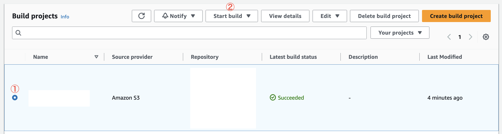

[JP](../ja/build.md) | EN

# Building process

This project will deploy the required assets and AWS services to run REDCap. However, the App Runner service requires a docker image with everything configured to execute. The creation of this image is done in another AWS service called AWS Codebuild.

Once the architecture and REDCap application code is uploaded to your AWS account (AWS S3), an AWS Lambda function triggers the Codebuild that creates the container image. After the process is successful, the image is pushed to Amazon Elastic Container Repository (ECR).

In this section, the process of building is described step by step.

## Architecture provisioning

First, you must run `yarn deploy --stage <your_stage_name>` command.
This command actually runs `sst deploy` and, `cdk deploy` is executed within it. The `cdk deploy` command is one of AWS CDK(Cloud Development Kit) commands that starts the provisioning. All subsequent steps will be triggered as part of this process.

## Build executed by AWS CodeBuild

Once `deploy` is executed, an AWS CodeBuild project is created. This is to perform a series of procedures to create a Docker image for REDCap. After that, AWS CDK's Trigger (with a AWS Lambda function) executes AWS CodeBuild's `StartBuild`. This creates a Docker Image and pushes it to ECR with the `latest` and REDCap's version tags.

## Automated deployment to App Runner

App Runner can automatically deploy new images pushed to ECR. In this project this setting is enabled. This means that when the image is updated, AWS App Runner will deploy that image using a blue/green strategy.

### How can we re-run build process?

You can re-run the build process after re-deploy via AWS Management Console or AWS CLI:

#### 1. AWS Management Console

In the AWS console go to [CodeBuild - Tokyo region](https://ap-northeast-1.console.aws.amazon.com/codesuite/codebuild/projects) (or the region you have deployed). In this page, you can find your build (with project name and stage) and select it, and then click the `Start build` button.



#### 2. AWS CLI

Confirm AWS CLI is installed in your computer first.

```sh
aws --version
```

Run the command which is outputted as `UpdateDeploymentCommand` after deployment.

```sh
✔  Deployed:
   Network
   BuildImage
   UpdateDeploymentCommand: aws lambda invoke --function-name <function-name> --region <region> --profile <profile> deployLambdaResponse.json
   ...
```
